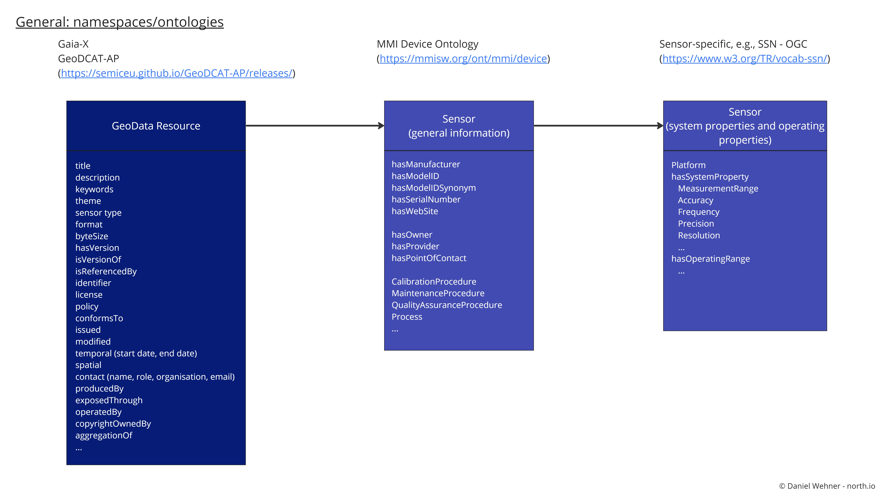

# selfdescriptions

The self-descriptions are single entries in a Federated Catalogue. The Federated Catalogue is basically a central repository of self-descriptions enabling the discovery and selection of providers, their service offerings and their assets. Self-descriptions are standardised, machine comprehensible metadata. A more detailed description about the role of self-descriptions within the Gaia-X ecosystem can be found in this Whitepaper (https://gaia-x.eu/wp-content/uploads/2022/08/SSI_Self_Description_EN_V3.pdf). Additional information about the Gaia-X architecture can be found in the Gaia-X Architecture Framework documents (https://docs.gaia-x.eu/).

All self-descriptions required for the Federated Catalogue in Marispace-X are collected here. The self-descriptions are in a draft phase and are steadily evaluated, updated and extended during the Marispace-X project

The self-descriptions are sorted into the following folders according to the respective entity (see Figure 1)  
- Participants (e.g., legal persons, companies, ...)
- Services (e.g., platform, software, infrastructure, ...)
- Resources (e.g., data, sensor devices, infrastructure, ...)
- Sensors (e.g., multibeam, ctd, camera, ...)

Resources and Sensors are separated into different entities in Marispace-X due to the complexity and large amount of different sensor types that exist (see Figure 1). The separation of "Sensors" is an extension to the Gaia-X framework. The resource self-descriptions "GeoData Resource" is the general self-descriptions of geospatial data resources. This self-description makes the data resource findable and accessible (**FA**IR principles - https://www.go-fair.org/fair-principles/) as they can be searched by geolocation, time, sensor type, theme. The "Sensor" self-description is a more detailed self-description of the specific sensor data, like "multibeam", "ctd", "camera" . This self-description makes the data interoperable and reusable (FA**IR** principles - https://www.go-fair.org/fair-principles/) as they contain attributes about sensor characteristics, sensor settings, and processing information. Technically, "Sensor" should be implemented as a child of a "GeoData Resource" (using the "aggregationOf" attribute from the Gaia-X ontologies).

*Figure 1: Concept for self-descriptions of different entities in the federated catalogue in Marispace-X*

Each self-description can have the three following data files. Only the verified JSON-LD will be stored in the Federated Catalogue.
- SHACL (template of the self-description that can be filled out using the SD Creation Wizard - https://sd-creation-wizard.gxfs.dev/)
- JSON-LD (self-description file created from the SHACL template using the SD Creation Wizard)
- verified JSON-LD (the self-description needs to be verified, "wrapped" into a verifiable paragraph)

For the self-descriptions of the entities "Participant", "Service Offering" ("Software", "Platform", "Infrastructure"), and "Resource" templates from Gaia-X exist that can also be used in Marispace-X. For the more specific descriptions of data and software resources, adaptions need to be made in Marispace-X. Therefore, these adaptions for the self-descriptions "GeoData Resource", "Sensor", and "Software  Resource" are described in the following.

First SHACL files need to be created as templates for each self-description required in Marispace-X. These SHACL files are based on existing standards/ontologies as good as possible.
The current concept for data resources is a follows (see Figure 2):
- general resource self-description "geoDataResourceShape.ttl" (based on GeoDCAT-AP ontologie - https://semiceu.github.io/GeoDCAT-AP/drafts/latest/) - "GeoDCAT-AP provides an RDF vocabulary and the corresponding RDF syntax binding for the union of metadata elements of the core profile of ISO 19115:2003 and those defined in the framework of the INSPIRE Directive."
  - the "Sensor" self-descriptions is divided into different SHACL files, from sensor-generic to survey- and sensor-specific descriptions. These SHACL files should be merged to a single json-LD self-description for the "Sensor", denoted as "*filename*-sensor.json", where filename is replace by the name of the respective data file (e.g., 20201023_101523_0001_MBES-sensor.json)
    - general sensor information self-description "sensorGeneralInformationShape.ttl" (based on MMI Device Ontology - https://mmisw.org/ont/mmi/device) - "Contains generic sensor attributes like sensor name, sensor manufacturer, sensor id, serial number, ..."
    - survey specific information self-description "sensorSurveyInformation.ttl" (based on MMI Device Ontology - https://mmisw.org/ont/mmi/device and GeoDCAT-AP ontologie - https://semiceu.github.io/GeoDCAT-AP/drafts/latest/) - "Contains generic survey information about the sensor file like contact of surveyor, start date, end date, location, ..."
    - detailed sensor information self-description with the file naming convention "sensor**Shape.ttl" where * is replaced with the sensor name, e.g., "sensorSideScanSonarShape.ttl", "sensorCTDShape.ttl", "sensorCameraShape.ttl", "sensorSatelliteRadarShape.ttl" (this can be based on very specific ontologies for the respectivce sensor type, e.g., OGC SSN - https://www.w3.org/TR/vocab-ssn/, OGC EO - https://docs.ogc.org/is/10-157r4/10-157r4.html) - "Contains detailed sensor settings and sensor-specific attributes like frequency, sampling rate, ..."
   

*Figure 2: Concept for self-descriptions of gesopatial data resources and corresponding sensor data in the federated catalogue in Marispace-X*
