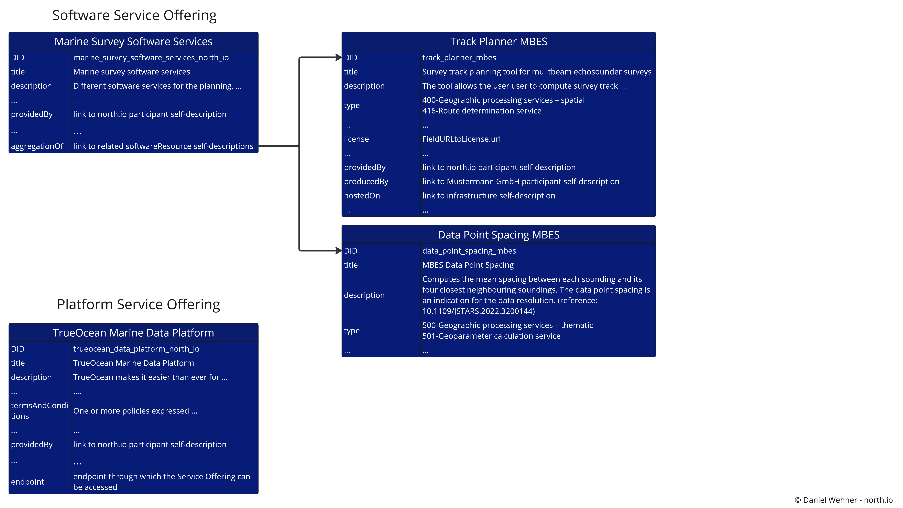

contact: Daniel Wehner, dwehner@north.io

## Table of Contents
- [Introduction](#introduction)
- [Schema: Self-Descriptions in Marispace-X](#schema)
  - [GeoData Resource/Sensor Self-Descriptions](#schema-geodataresource)
  - [Software Resource Self-Descriptions](schema-softwareresource)
- [Examples: Self-Descriptions in Marispace-X](#examples)
  - [Example GeoData Resource/Sensor](#examples-geodataresource)
  - [Example Software/Platform Offering](#examples-softwareresource)
  - [Example Physical Resource](#examples-physicalresource)

# Introduction
The self-descriptions are single entries in a Federated Catalogue. The Federated Catalogue is basically a central repository of self-descriptions enabling the discovery and selection of providers, their service offerings and their assets. Self-descriptions are standardised, machine comprehensible metadata. A more detailed description about the role of self-descriptions within the Gaia-X ecosystem can be found in this Whitepaper (https://gaia-x.eu/wp-content/uploads/2022/08/SSI_Self_Description_EN_V3.pdf). Additional information about the Gaia-X architecture can be found in the Gaia-X Architecture Framework documents (https://docs.gaia-x.eu/).

**NOTE**: Metadata and Data Quality are defined as two different things, which is also reflected in the ISO standard documents being split into “ISO 19115 - Geographic Information – Metadata” and “ISO 19157 - Geographic Information – Data Quality”. Metadata and Data Quality could be defined as
- Metadata: Facts about the data
- Data Quality: Interpretation of the facts and the contained data. Data Quality depends on the specific goals the user likes to achieve with the data.

# Schema: Self-Descriptions in Marispace-X 
All self-descriptions required for the Federated Catalogue in Marispace-X are collected here. The self-descriptions are in a draft phase and are steadily evaluated, updated, and extended during the Marispace-X project.

The self-descriptions are sorted into the following folders according to the respective entity (see Figure 1).
- Participants (e.g., legal persons, companies, ...)
- Service Offerings (e.g., platform, software, infrastructure, ...)
- Resources (e.g., data, sensor devices, infrastructure, ...)
  - Sensors (e.g., multibeam, ctd, camera, ...)

Resources and Sensors are separated into different entities in Marispace-X due to the complexity and large amount of different sensor types that exist (see Figure 1). The separation of "Sensors" is an extension to the Gaia-X framework. The resource self-description "GeoData Resource" is the general self-description of geospatial data resources. This self-description makes the data resource findable and accessible (**FA**IR principles - https://www.go-fair.org/fair-principles/) as they can be searched by geolocation, time, theme. The "Sensor" self-description is a more detailed self-description of the specific sensor data, like "multibeam", "ctd", "camera" . This self-description makes the data interoperable and reusable (FA**IR** principles - https://www.go-fair.org/fair-principles/) as they contain attributes about sensor characteristics, sensor settings, and processing information. Technically, "Sensor" should be implemented as a child of a "GeoData Resource" (using the "gax-trust-framework:aggregationOf" attribute from the Gaia-X ontologies, "dcat:Dataset" attribute related to tree specification, https://treecg.github.io/specification/, or the "hasPart" attribute as RO-Crate data entities related to schema.org/dcat, https://www.researchobject.org/ro-crate/1.1/data-entities.html#referencing-files-and-folders-from-the-root-data-entity).

*Figure 1: Concept for self-descriptions of different entities in the federated catalogue in Marispace-X*

Each self-description can have the three following data files:
- SHACL (template of the self-description that can be filled out using the SD Creation Wizard - https://sd-creation-wizard.gxfs.dev/)
- JSON-LD (self-description file created from the SHACL template using the SD Creation Wizard)
- verified JSON-LD (the self-description needs to be verified, "wrapped" into a verifiable paragraph)
Only the verified JSON-LD will be stored in the Federated Catalogue. All entities that already have a SHACL, JSON-LD, and/or a verified JSON-LD file can be found in the respective folders in this repository (selfdescriptions/).

For the self-descriptions of the entities "Participant", "Service Offering" ("Software", "Platform", "Infrastructure"), and "Resource" templates from Gaia-X exist that can also be used in Marispace-X. For the more specific self-descriptions of data and software resources, adaptions need to be made in Marispace-X. Therefore, these adaptions for the self-descriptions "GeoData Resource", "Sensor", and "Software  Resource" are described in the following. Afterwards, different example scenarios for filled self-descriptions are given.

## GeoData Resource/Sensor Self-Descriptions 
First, SHACL files need to be created as templates for each self-description required in Marispace-X. These SHACL files are based on existing standards/ontologies as good as possible, so that the data space is compatible with existing repositories.
The current concept for data resources is a follows (see Figure 2):

- general resource self-description "geoDataResourceShape.ttl" (based on GeoDCAT-AP ontologie - https://semiceu.github.io/GeoDCAT-AP/drafts/latest/ - and Gaia-X ontologies - https://gaia-x.gitlab.io/technical-committee/federation-services/data-exchange/dewg/#data-product) - "GeoDCAT-AP provides an RDF vocabulary and the corresponding RDF syntax binding for the union of metadata elements of the core profile of ISO 19115:2003 and those defined in the framework of the INSPIRE Directive."
  - the "Sensor" self-descriptions are divided into different SHACL files, from sensor-generic to survey- and sensor-specific descriptions. These SHACL files should be merged or interlinked between each other to have a single json-LD self-description for the "Sensor", denoted as "filename.json", where filename is replace by the name of the respective data file (e.g., 20201023_101523_0001.json). Hence, for each data file a "Sensor" self-description can exist. Based on the technical feasibility, the three "Sensor" SHACL files are either first merged into one SHACL file, then filled out and converted to a JSON-LD, or the three SHACL files are first filled out, then converted to JSON-LDs and afterwards merged into one JOSN-LD, or the "sensor**Shape.ttl" is linked to the other two JSON-LD files. The benefit of the last solution is that the "sensorGeneralInformationShape.ttl" and "sensorSurveyInformation.ttl" files only need to be created once. The benefit of this split into different SHACL files is, that individual parts can easily be replaced with other ontologies if required. NOTE: the "sensorGeneralInformationShape.ttl" and "sensorSurveyInformation.ttl" template files are optional and might not be required if a standard already exists for a specific sensor type (e.g., the OGC EOP standard, https://docs.ogc.org/is/13-026r8/13-026r8.html, for satellite data). In this case, only the "sensor* *Shape.ttl" is required.
    - detailed sensor information self-description with the file naming convention "sensor**Shape.ttl" where * is replaced with the sensor name, e.g., "sensorSideScanSonarShape.ttl", "sensorCTDShape.ttl", "sensorCameraShape.ttl", "sensorSatelliteRadarShape.ttl" (this can be based on very specific ontologies for the respectivce sensor type, e.g., OGC SSN - https://www.w3.org/TR/vocab-ssn/, OGC EO - https://docs.ogc.org/is/10-157r4/10-157r4.html ; as many attributes are so specific that no ontolgies already exist, the current idea is to extend the MMI Device Ontology) - "Contains detailed sensor settings and sensor-specific attributes like frequency, sampling rate, ..."
    - general sensor information self-description "sensorGeneralInformationShape.ttl" (based on MMI Device Ontology - https://mmisw.org/ont/mmi/device - and Gaia-X ontologies - https://gaia-x.gitlab.io/technical-committee/federation-services/data-exchange/dewg/#data-product - could potentially be linked with NERC L22 vocabulary - http://vocab.nerc.ac.uk/collection/L22/current/) - "Contains generic sensor attributes like sensor name, sensor manufacturer, sensor id, serial number, ... that is applicable to every sensor type"
    - survey specific information self-description "sensorSurveyInformation.ttl" (based on MMI Device Ontology - https://mmisw.org/ont/mmi/device - and GeoDCAT-AP ontologie - https://semiceu.github.io/GeoDCAT-AP/drafts/latest/ - and Gaia-x ontology - https://gaia-x.gitlab.io/technical-committee/federation-services/data-exchange/dewg/#data-product) - "Contains generic survey information about the sensor file like contact of surveyor, calibration, processing, ..."
   

*Figure 2: Concept for self-descriptions of gesopatial data resources and corresponding sensor data in the federated catalogue in Marispace-X*

## Software Resource Self-Descriptions 
First, SHACL files need to be created as templates for each self-description required in Marispace-X. These SHACL files are based on existing standards/ontologies as good as possible.
The current concept for data services is a follows:

- the software resource self-description template "softwareResourceShape.ttl" from Gaia-X is adapated to the needs for geospatial data services (based on GeoDCAT-AP ontologie - https://semiceu.github.io/GeoDCAT-AP/drafts/latest/ - and Gaia-X ontologies - https://gaia-x.gitlab.io/technical-committee/federation-services/data-exchange/dewg/#data-product) - "GeoDCAT-AP provides an RDF vocabulary and the corresponding RDF syntax binding for the union of metadata elements of the core profile of ISO 19115:2003 and those defined in the framework of the INSPIRE Directive.". The corresponding JSON-LD file is named "softwareResource-servicename" where servicename is replaced with the respective title of the software service (e.g., softwareResource-TrackPlanner_MBES.json)

# Examples: Self-Descriptions in Marispace-X 
Example files for different applications are given in the repository, which are the JSON-LD self-descriptions filled from the SHACL template files. An overview of different examples is given below.

## Example GeoData Resource/Sensor 
Examples for GeoDataResources are illustrated in Figure 3. The data example is taken from the publicly available data repository "Data Hub Preliminary Investigation of Sites" from the BSH for the site N-3.7 (https://pinta.bsh.de/N-3.7?lang=en&tab=daten). For each data resource the geoDataResource self-descriptions needs to be filled (Figure 3, dark blue). The self-description should be able to inherit several different other geoDataResource and sensor self-descriptions to allow to replicate commonly used folder structures for geospatial projects. Hence, the example in Figure 3 consists of a major project data set "BSH data set" and several specific sensor data sets "Multibeam Echosounder Data Raw", "Multibeam Echosounder Data Processed", "Multibeam Echosounder Data Product", "Side Scan Sonar Data Raw". For the "*Raw" data sets which contain the original sensor data, the detailed sensor self-descriptions can be added. This level of detail allows to fullfil the FAIR principles as mentioned in the section "Schema: Self-Descriptions in Marispace-X" section and hence improve the usage of such data as more information is available.

*Figure 3: Example for GeoDataResource offerings, including detailed Sensor self-descriptions for the raw sensor data files. The corresponding JSON-LD files can be found in the respective subfolder of the selfdescriptions/ folder*

## Example Software/Platform Offering 
Examples for a software and platform offering are illustrated in Figure 4. The software service offering can consist of multiple software resources (software tools) which are part of the offering, but it could also be only a single software offering where the link to additional software resources might not be necessary. This is the case for the platform offering where only a single self-descriptions exist to describe the service offering.

*Figure 4: Example for a software service offering and a platfrom service offering. The corresponding JSON-LD files can be found in the respective subfolder of the selfdescriptions/ folder*

## Example Physical Resource 
Examples for a physical resources are illustrated in Figure 5. The service offering is a rental of different survey equipment. So the service offering is linked to differnt physical resources like "Multibeam Echosounder Rental" and "Side Scan Sonar Rental". These physical resources can make use of the sensorGeneralInformation self-descriptions. If the self-description of the offered sensor already exists in the Federated Catalgoue, the physical resource can link to this sensor and so automatically adds the general information about the sensor.

*Figure 5: Examples for physical resources offered via a service. The corresponding JSON-LD files can be found in the respective subfolder of the selfdescriptions/ folder*
